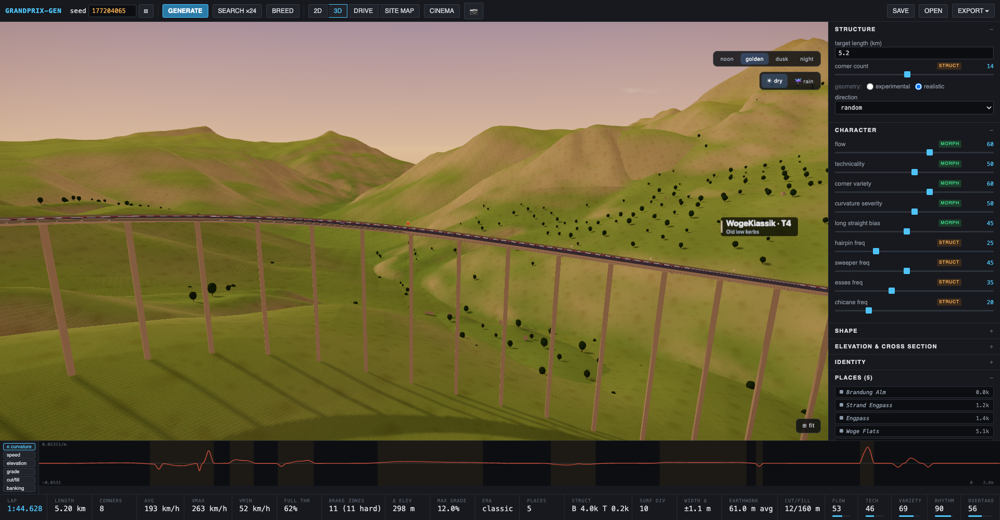
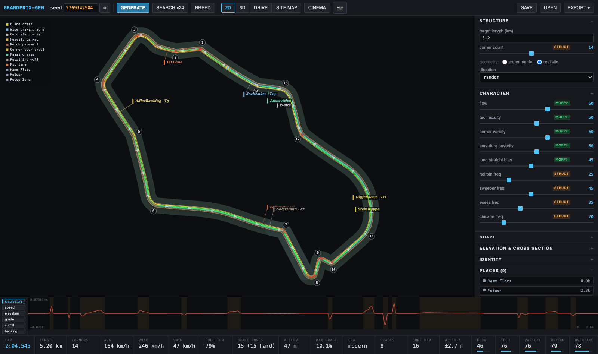
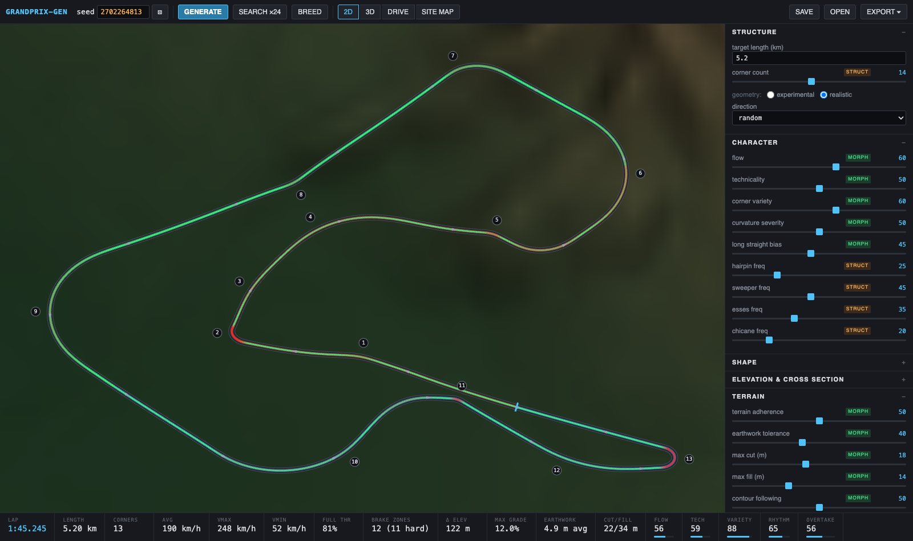
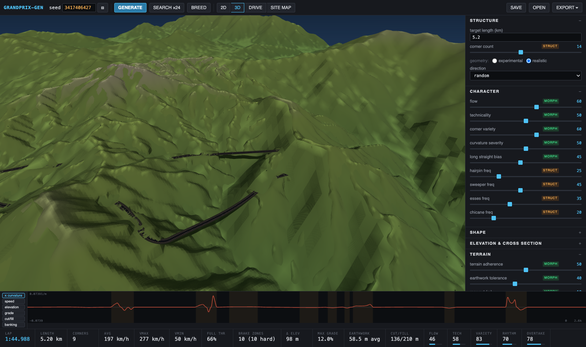
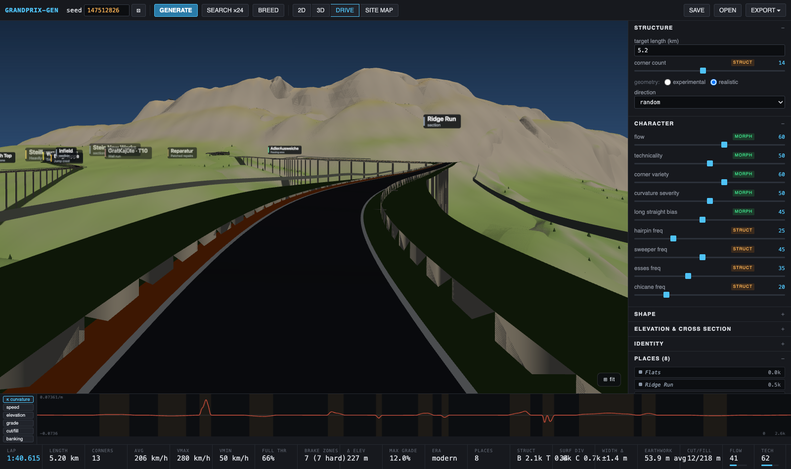

# grandprix-gen



**Procedural racetrack generator / parametric circuit-design sandbox.**

Not a "random squiggly loop" toy — a lightweight experimental circuit-design
tool: deterministic seeds, road-design geometry (clothoid transitions),
character-driven parameters, continuous morphing, a simplified vehicle model,
real-world terrain integration, candidate search, track breeding, and serious
exports (CAD / GIS / Civil 3D / Blender / simulation).










## Run it

```bash
npm install
npm run dev        # http://localhost:5173
npm test           # vitest: invariants, determinism, exports, fuzz
npm run build      # typecheck + production build
```

Everything is browser-local. No backend. Terrain DEM comes from
[Mapterhorn](https://mapterhorn.com) (Terrarium tiles, no key); the basemap is
[OpenFreeMap](https://openfreemap.org) via MapLibre GL.

## What you can do

1. **Generate** — a circuit from a seed. Same `seed + params + version` → same track.
2. **Morph** — drag Flow, Technicality, Severity, Compactness, Elevation… and
   watch *the same circuit* deform continuously (morphable vs structural params
   are explicitly distinguished; structural ones re-synthesize from the seed).
3. **Search ×24** — candidate search with rejection + scoring, then *diversity*
   selection: you get a labeled spread (FLOWING / TECHNICAL / FAST / WEIRD /
   EXTREME / BALANCED), not one canonical blob.
4. **Breed** — select two candidates, produce mutated offspring combining their
   structural DNA. Interactive evolutionary search; you are the fitness function.
5. **Analyze** — quasi-static vehicle model (GT3 / Prototype / Formula / Road):
   speed envelope, lap time, braking zones, full-throttle %, plus interpretable
   metrics (flow, technicality, corner diversity, rhythm, overtaking heuristic,
   elevation interest, earthwork…).
6. **Real terrain** — SITE MAP: navigate anywhere (try mountainous Japan),
   place a site, load the Mapterhorn DEM, and generate circuits where terrain
   is a *design constraint*: horizontal layouts are scored by grade-feasible
   earthwork, the vertical profile hugs the ground inside a cut/fill band with
   hard grade limits. OSM building footprints render as context and (soft/hard)
   steer generation around development. **SCOUT REGION** searches a whole
   region for promising sub-sites first (nested site→circuit optimization).
7. **Views** — 2D design view (heat layers: curvature / speed / elevation /
   grade / cut-fill / banking; contour lines; building footprints), 3D view
   (banked ribbon, striped kerbs where the car actually uses them, edge lines,
   carved + shadowed terrain, surrounding context, trees, buildings, water),
   DRIVE mode (onboard lap at the estimated speed profile).
8. **Export** — `.track.json` (lossless project), SVG, CSV, GeoJSON, DXF,
   LandXML (Civil 3D), OBJ, GLB, Blender reconstruction `.py`, OpenDRIVE
   `.xodr`, or everything at once as a zip package.

Keyboard: `g` generate · `1/2/3` views · `⌘Z` undo.

### Heterogeneous circuit model

The ribbon is not homogeneous. Variation lives on **three spatial scales**:

- **micro (~meters)** -- pavement seams every ~28 m, concrete slab joints,
  patched repair bands, per-station micro-bumps scaled by roughness, kerb
  mottle. Visual-only; physics stays clean.
- **local (tens/hundreds of meters)** -- 28 kinds of localized *features*
  anchored to the structural DNA: banked concrete bowls (karussell),
  blind/jump crests, compressions (incl. major), corner-over-crest and
  corner-in-compression composites, off-camber / cambered / heavily-banked /
  concrete-lined corners, rough zones, resurfaced patches, drainage dips,
  downhill/uphill braking zones, widened passing areas, crown transitions,
  legacy narrows, wall runs, retaining-wall runs, narrow shoulders,
  sausage/old-low/high kerb sections, service-road crossings, pit lane with
  tapered merge. Each alters several properties *simultaneously* (geometry,
  surface, grip, kerbs, runoff, barriers) and gets a generated **place
  name**, so a lap develops recognizable places.
- **sector (~kilometers)** -- named character zones (historic / rebuilt /
  mountain / developed / open / confined) bias width, roughness, runoff and
  barrier distances across whole sections, with long smooth ramps between.

All of it emerges from a latent **circuit identity** (era, construction
style, roughness and width-variation baselines, terrain coupling), not from
independent per-meter noise. The vehicle model reads grip/roughness per
sample; the same circuit laps differently as its surface changes.

### Terrain conformance & structures

In site mode the road never clips the land. The vertical design treats

1. the **floor** (z >= ground - maxCut) as a hard constraint -- burial is
   forbidden,
2. the **grade limit** as hard,
3. the **fill ceiling** as soft -- where the land is steeper than the road
   may climb, the road leaves the band *upward* and a structure owns the gap.

An exact raise-only floor+slope solver (tripled-domain circular envelope)
guarantees 1+2; span classification then turns deviations into civil
engineering: **viaducts** (deck edge beams, parapets, piers every ~32 m down
to the ground), **embankments** (grass skirts), **retaining walls** and
**rock cuts** on hillsides, and **tunnels** (tube + portals) under ridges.
Terrain carving seats the road 0.4 m proud of a flattened corridor, benches
narrowly into cuts, and leaves the ground alone under bridges and over
tunnels. Site search candidates relocate within the site and are scored by
cross-slope, earthwork (with a superlinear penalty on giant fills),
contour-following, and building overlap (OSM footprints; soft cost or hard
rejection).

### Rendering & atmosphere

The 3D view is built to be looked at, not just inspected:

- **Post pipeline**: ACES filmic tone mapping, subtle bloom, SMAA, vignette.
- **Stylized sky dome** (custom shader): saturated gradients, sun disk +
  halo, drifting fbm clouds, twinkling star field + moon at night.
- **Time of day**: noon / golden hour / dusk / night presets; night lights
  the circuit with floodlight poles (pooled real lights follow the camera).
- **Weather**: rain mode -- wet asphalt (roughness lerps down, metalness
  up), slate overcast, close fog, camera-following rain streaks.
- **Surface detail**: racing-line rubber darkening (outside-in-out through
  corners), skid patches at braking entries, asphalt speckle, grass blade
  and gravel textures, castellated aggressive/sausage kerbs.
- **Trackside**: distance boards (150/100/50) at corner entries, seeded
  sponsor billboards, start gantry + painted grid slots, grandstands with
  colored seats, marshal posts, pit lane with tapered merge.
- **Nature**: two tree species with trunks (conifers take the high
  ground), animated ripple water with sun glint, drifting cloud shadows.
- **Drive mode**: HUD (speed/gear/rpm, pedal trace, lap timer, mini map,
  feature flash), FOV kick at speed, roughness-scaled camera shake
  (heritage circuits ride genuinely rough), headlight in the dark.
- **CINEMA** button for an auto-orbiting aerial shot, and a camera button
  that saves the current frame as PNG.
- The **2D map** is a live schematic: speed-heat ribbon (red apices,
  green straights), direction chevrons, feature chips + legend, sector
  zone halos, drop shadow, animated lap dot, station tooltip.

## Architecture

```
src/
  core/            UI-free engine (node-testable)
    prng.ts          deterministic mulberry32 + Rng helpers
    types.ts         canonical Track: samples queryable by distance s
    elements.ts      road-design DNA: straights + clothoid corners, morphs
    geometry.ts      curvature integration, closure repair, self-intersection
    build.ts         full pipeline: elements → κ(s) → integrate → deform →
                     resample → corners → vertical → banking → width
    generator.ts     character params → element sequences (corner complexes)
    morph.ts         identity-preserving deformation / structural re-synthesis
    validate.ts      plausibility linting (radius, jerk, intersections, grades)
    vehicle.ts       speed envelope (banking/grade-aware, fwd/bwd passes)
    metrics.ts       interpretable metric vector + request scoring
    search.ts        candidate search + max-min diversity selection
    breed.ts         element crossover + mutation, winding repair
    terrain.ts       TerrainGrid (bilinear, slope), Mapterhorn provider
    terrainGen.ts    terrain-aware candidate scoring + site scouting
    geo.ts           WGS84 ↔ local ENU metric frame, web-mercator tile math
    vertical.ts      vertical design: sinusoids / cut-fill band + grade limit
  engine/          plain-data jobs (generate/search/morph/breed/scout)
  workers/         web worker wrapper (main thread stays responsive)
  export/          json, svg, csv, geojson, dxf, landxml, obj, glb,
                   blender(.py), opendrive(.xodr), zip package, shared mesh
  ui/              vanilla-TS views: 2D canvas, three.js, MapLibre, controls
tests/             vitest: determinism, invariants, exports, fuzz
```

### Canonical representation

The rendered mesh is never the source of truth. A `Track` is:

- structural **DNA**: ordered straights + clothoid corners
  (`radius, angle, dir, transition`) + deform state + generation-time base
- canonical **samples**: uniform arc-length (`s`, x, y, z, heading, κ, bank,
  width, groundZ, speed) — everything else derives from these
- derived: corners, sectors, start/finish, speed profile, metrics

`seed + params + generator version + site` fully reproduces a design.
Morphs transform pristine DNA relative to the base snapshot (no drift).

### How closure works

Element sequences rarely close by construction. Two-stage fix:
least-squares adjustment of straight lengths, then an exact curvature-basis
repair (`c₀ + c₁·sin(2πs/L) + c₂·cos(2πs/L)`) solved on the linearized
3×3 system — residual closure error < 5 cm on a 5 km lap.

### Terrain vertical design

Ground profile → cut/fill band (earthwork params) → periodic grade limiter
(duplicated open-chain + seam correction; converges to the exact max grade)
→ projected relaxation toward ground. The road hugs terrain where grades
allow and does honest earthworks (cut/fill metrics) where the land is
steeper than the road may be.

## Testing philosophy

Procedural geometry begs for invariant testing:

- determinism (same seed → same samples)
- closure, no NaN/Infinity, min radius, curvature continuity
- length tolerance, self-intersection (grid broadphase)
- grade limits (blank + terrain), cut/fill band sanity
- geo frame round-trips, bilinear interpolation
- project JSON lossless round-trip; CSV/SVG/DXF/OpenDRIVE/LandXML sanity
- breeding/search determinism, diversity guarantees
- fuzz: 40 random param/seed combos never produce wild geometry

## Deliberate scope cuts

No accounts, no cloud, no collaboration, no OSM constraint layers yet, no
FIA-compliance claims ("Realistic" is plausibility linting, not certification).

## License

MIT
